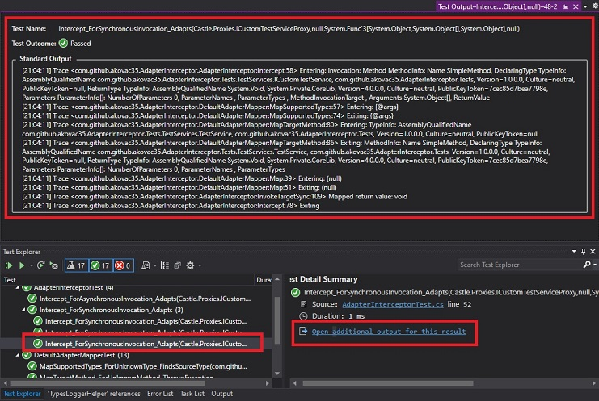

# Logging
This library contains helpful resources for .NET Core and ASP.NET Core logging using various logger frameworks and ```Microsoft.Extensions.Logging.ILogger``` interface.


* [com.github.akovac35.Logging](https://www.nuget.org/packages/com.github.akovac35.Logging/)

	[](https://www.nuget.org/packages/com.github.akovac35.Logging/)
	
* [com.github.akovac35.Logging.AspNetCore](https://www.nuget.org/packages/com.github.akovac35.Logging.AspNetCore/)

	[](https://www.nuget.org/packages/com.github.akovac35.Logging.AspNetCore/)

* [com.github.akovac35.Logging.Testing](https://www.nuget.org/packages/com.github.akovac35.Logging.Testing/)

	[](https://www.nuget.org/packages/com.github.akovac35.Logging.Testing/)

* [com.github.akovac35.Logging.NLog](https://www.nuget.org/packages/com.github.akovac35.Logging.NLog/) - just helper methods

	[](https://www.nuget.org/packages/com.github.akovac35.Logging.NLog/)

* [com.github.akovac35.Logging.Serilog](https://www.nuget.org/packages/com.github.akovac35.Logging.Serilog/) - just helper methods

	[](https://www.nuget.org/packages/com.github.akovac35.Logging.Serilog/)

## Status

PRODUCTION READY starting from version 1.0.5.

## Samples

Advanced samples utilizing library functionality are provided here: [Logging.Samples](https://github.com/akovac35/Logging.Samples)

## Contents

- [Logging](#logging)
  - [Status](#status)
  - [Samples](#samples)
  - [Contents](#contents)
    - [Logger helper](#logger-helper)
    - [Invocation context logging](#invocation-context-logging)
    - [Method entry and exit logging](#method-entry-and-exit-logging)
    - [Log correlation](#log-correlation)
    - [Unit test logging](#unit-test-logging)
    - [3rd party logger frameworks helper methods](#3rd-party-logger-frameworks-helper-methods)
    - [Message template examples](#message-template-examples)
  - [Contributing](#contributing)
	- [Contributors](#contributors)
  - [License](#license)

Logging is an important aspect of any application framework. Compared to Java logging, configuring .NET Core and ASP.NET Core applications for logging seems trivial at first, until we encounter framework specifics related to async code execution that make it impossible to correlate log entries based on the thread id - async methods may switch threads during different stages of the execution, so it is not possible to distinguish which log entry belongs to a specific activity without some sort of log entry correlation being provided with each log entry. This logging library provides means with which it is possible to correlate application activity and log entries, and more.

The following functionality **is provided for Microsoft.Extensions.Logging**:

### Logger helper

This library provides a static generic helper class ```LoggerHelper<T>``` using which it is possible to log application startup events or perform limited logging inside types without having to inject a logger instance:

```cs
using com.github.akovac35.Logging;
using Microsoft.Extensions.Logging;
using System;

// Import LoggerHelper<T> properties
using static com.github.akovac35.Logging.LoggerHelper<ConsoleApp.Program>;

namespace ConsoleApp
{
    public class Program
    {
        public static async Task Main(string[] args)
        {
            // Configure logger framework at application startup first and then
            // define a logger factory for this library to use:
            // ... logger framework initialization sufficient for logging application startup events ...
            LoggerFactoryProvider.LoggerFactory = new XYZLoggerFactory(); // SerilogLoggerFactory, NLogLoggerFactory, ...
            
	    // "Logger" property is imported with the "using static" directive and is provided by the LoggerHelper<T>
            Logger.Entering(args);

            try
            {
                // Perform work here

                Logger.Exiting(args);
            }
            catch (Exception ex)
            {
                Logger.LogError(ex, ex.Message);
                throw ex;
            }
            finally
            {
                // Dispose logger framework
            }
        }
    }
}
```

**Do note that the ```LoggerFactoryProvider.LoggerFactory``` must be defined immediately when application is started**. Failing to do so will cause ```NullLoggerFactory``` to provide logger instances, which do not perform logging. Update the ```LoggerFactoryProvider.LoggerFactory``` reference if logger factory changes during application lifetime.

```LoggerHelper<T>``` should never be used inside static constructors because ```LoggerFactoryProvider.LoggerFactory``` may not yet be ready, or its reference used to initialize variables (reference will be stale when ```LoggerFactoryProvider.LoggerFactory``` changes).

### Invocation context logging

Generally it is useful to have method name and source code line number included with the log entry for easier troubleshooting or simpler coding:

```
[2020-03-26 23:39:11.943 +01:00] INF 25 410eb646-d979-4814-9f17-8b622ec44ffb <WebApp.Pages.Counter:IncrementCount:29> currentCount: 1
```

This library includes ```Here(Action<ILogger> logAction)``` methods which do just that: 

```cs
using com.github.akovac35.Logging;
_logger.Here(l => l.LogInformation("currentCount: {0}", currentCount));

//or

using static com.github.akovac35.Logging.LoggerHelper<WebApp.Pages.Counter>
Here(l => l.LogInformation("currentCount: {0}", currentCount));
```

It is important to note that instead of using reflection, invocation context is determined with the help of compiler service attributes, which minimizes performance impact. Benchmarking revealed that invocation overhead of ```_logger.Here(Action<ILogger> logAction)``` versus direct logger method invocation is about 30%, which is negligible.

When this functionality is not disabled, invocation context is passed to logger frameworks via ```ILogger.BeginScope()```, as follows:

```cs
using (logger.BeginScope(
    new[] { new KeyValuePair<string, object>(Constants.CallerMemberName, callerMemberName),
            new KeyValuePair<string, object>(Constants.CallerFilePath, callerFilePath),
            new KeyValuePair<string, object>(Constants.CallerLineNumber, callerLineNumber)})
    )
    {
        try
        {
            logAction(logger);
        }
        catch (Exception ex)
        {
            logger.LogTrace(ex, ex.Message);
        }
    }
```

Invocation context capture can be disabled by setting ```LoggerLibraryConfiguration.ShouldHerePassInvocationContextToLoggerScope = false```.

### Method entry and exit logging

Logging method entry and exit is generally a good practice because it makes production problem resolution easier and writing code simpler. It is much easier to troubleshoot problems when method input parameters and return values are available. It is also much simpler to write logging code knowing that log will first contain an entry statement with method name and source code line number from which it is possible to infer general context and meaning:

```
[2020-03-26 23:39:11.943 +01:00] VRB 25 410eb646-d979-4814-9f17-8b622ec44ffb <WebApp.Pages.Counter:IncrementCount:26> Entering
[2020-03-26 23:39:11.943 +01:00] INF 25 410eb646-d979-4814-9f17-8b622ec44ffb <WebApp.Pages.Counter:IncrementCount:29> currentCount: 1
[2020-03-26 23:39:12.454 +01:00] VRB 15 410eb646-d979-4814-9f17-8b622ec44ffb <WebApp.Pages.Counter:IncrementCount:35> Exiting

```

```razor
@using Microsoft.Extensions.Logging
@using com.github.akovac35.Logging

@inject ILogger<WebApp.Pages.Counter> logger

private async Task IncrementCount()
{
    logger.Here(l => l.Entering());

    currentCount++;
    // No need to write which counter we are increasing, which method etc.
    logger.Here(l => l.LogInformation("currentCount: {0}", currentCount));

    logger.Here(l => l.Exiting());
}
```

Method input parameters and return values can be logged as well:

```
[2020-03-26 23:36:14.420 +01:00] VRB 10 a90aead6-da9c-4adf-af70-d2e7aabd729e <Shared.Services.WeatherForecastService:GetForecastAsync:37> Entering: 03/26/2020 23:36:14
[2020-03-26 23:36:14.422 +01:00] VRB 10 a90aead6-da9c-4adf-af70-d2e7aabd729e <Shared.Services.WeatherForecastService:GetForecastAsync:49> Exiting: Task`1 {Result=[WeatherForecast {Date=03/27/2020 23:36:14, TemperatureC=-12, TemperatureF=11, Summary="Scorching"}, WeatherForecast {Date=03/28/2020 23:36:14, TemperatureC=42, TemperatureF=107, Summary="Chilly"}, WeatherForecast {Date=03/29/2020 23:36:14, TemperatureC=42, TemperatureF=107, Summary="Cool"}, WeatherForecast {Date=03/30/2020 23:36:14, TemperatureC=3, TemperatureF=37, Summary="Sweltering"}, WeatherForecast {Date=03/31/2020 23:36:14, TemperatureC=43, TemperatureF=109, Summary="Freezing"}], Id=1, Exception=null, Status=RanToCompletion, IsCanceled=False, IsCompleted=True, IsCompletedSuccessfully=True, CreationOptions=None, AsyncState=null, IsFaulted=False}

```

```cs
using com.github.akovac35.Logging;

public Task<WeatherForecast[]> GetForecastAsync(DateTime startDate)
{
    _logger.Here(l => l.Entering(startDate));

    // ...

    _logger.Here(l => l.Exiting(tmp));
    return tmp;
}
```

Because method entry and exit logging can be quite verbose, the default log level used is ```Trace```. Method overloads are available so this can be changed, which is useful for use in APIs where request and response objects are generally always logged. ```ILogger``` extension method ```IsEnteringExitingEnabled``` can be used for testing if method entry and exit logging is enabled - this is useful when preprocessing logger inputs.

**Do note that some objects, such as connections and requests, may require a more sophisticated approach than the one indicated here.** This is usualy because logging such objects may trigger an exception for some invoked properties, or it may cause performance problems. Either do not log such objects or use wrappers and only expose safe properties.

### Log correlation

Correlating application activity and log entries in .NET is not as straightforward as in e.g. Java. There, it would be sufficient to log a method entry, which will occur on a particular thread, and afterward track that thread until a relevant method exit log entry is reached. The main issue preventing the described approach in .NET is async functionality which makes it less likely that an activity will execute only on the thread which started it.

Console applications can achieve correlation easily with logger scopes:

```cs
using Microsoft.Extensions.Logging;
using com.github.akovac35.Logging.Correlation

using (_logger.BeginScope(new[] { new KeyValuePair<string, object>(Constants.CorrelationId, 12345678) }))
{
    List<Task<int>> tasks = new List<Task<int>>();
    for (int i = 0; i < 10; i++)
    {
        tasks.Add(BusinessLogicMock<object>.GetTaskInstance());
    }

    // Business logic call sample
    await Task.WhenAll(tasks);
}
```

This library provides dedicated correlation services to achieve correlation in ASP.NET Core applications:

```cs
using com.github.akovac35.Logging.AspNetCore.Correlation;

public void ConfigureServices(IServiceCollection services)
{
    services.AddLoggingCorrelation();
    
    // ...
}

public void Configure(IApplicationBuilder app, IWebHostEnvironment env)
{
    // ...
    
    app.UseLoggingCorrelation();
    
    // ...   
}
```

Correlation value for the current ambient context can be obtained as follows:

```cs
using com.github.akovac35.Logging.Correlation;

CorrelationProvider.CurrentCorrelationProvider?.GetCorrelationId();

```

If enabled, the ```LoggingCorrelationMiddleware``` will find and extract the ```x-request-id``` header value and use it for log correlation:

```cs
using com.github.akovac35.Logging.AspNetCore.Correlation;

public void ConfigureServices(IServiceCollection services)
{
    services.AddLoggingCorrelation(correlationIdHeaderName: "x-request-id", obtainCorrelationIdFromRequestHeaders: true);
    
    // ...
}

public void Configure(IApplicationBuilder app, IWebHostEnvironment env)
{
    // ...
    
    app.UseLoggingCorrelation();
    
    // ...
}
```

Example result:

```
curl -i -H "Accept: application/json" -H "Content-Type: application/json" -H "x-request-id: 12345678" -k https://localhost:5001/weatherforecast

[2020-03-23 00:26:57.287 +01:00] INF 4 54cf926d-457d-443e-a8e7-898cae0fb0ae <Microsoft.AspNetCore.Hosting.Diagnostics::> Request starting HTTP/2 GET https://localhost:5001/weatherforecast application/json 
[2020-03-23 00:26:57.291 +01:00] INF 4 12345678 <Microsoft.AspNetCore.Routing.EndpointMiddleware::> Executing endpoint '"WebApi.Controllers.WeatherForecastController.Get (WebApi)"'
[2020-03-23 00:26:57.294 +01:00] INF 4 12345678 <Microsoft.AspNetCore.Mvc.Infrastructure.ControllerActionInvoker::> Route matched with "{action = \"Get\", controller = \"WeatherForecast\"}". Executing controller action with signature "System.Threading.Tasks.Task`1[Shared.Services.WeatherForecast[]] Get()" on controller "WebApi.Controllers.WeatherForecastController" ("WebApi").
[2020-03-23 00:26:57.297 +01:00] VRB 4 12345678 <Shared.Services.WeatherForecastService:.ctor:18> Entering: CorrelationProvider { Value: Correlation { Id: "12345678" } }
[2020-03-23 00:26:57.300 +01:00] VRB 4 12345678 <Shared.Services.WeatherForecastService:.ctor:23> Exiting
[2020-03-23 00:26:57.302 +01:00] VRB 4 12345678 <WebApi.Controllers.WeatherForecastController:.ctor:29> Entering: WeatherForecastService {  }
[2020-03-23 00:26:57.307 +01:00] VRB 4 12345678 <WebApi.Controllers.WeatherForecastController:.ctor:34> Exiting
[2020-03-23 00:26:57.309 +01:00] VRB 4 12345678 <WebApi.Controllers.WeatherForecastController:Get:46> Entering
[2020-03-23 00:26:57.311 +01:00] VRB 4 12345678 <Shared.Services.WeatherForecastService:GetForecastAsync:37> Entering: 03/23/2020 00:26:57
[2020-03-23 00:26:57.313 +01:00] INF 4 12345678 <Shared.Services.WeatherForecastService:GetForecastAsync:39> CorrelationId is useful for correlating log contents with service or web page requests: "12345678"
[2020-03-23 00:26:57.315 +01:00] VRB 4 12345678 <Shared.Services.WeatherForecastService:GetForecastAsync:49> Exiting: Task`1 { Result: [WeatherForecast { Date: 03/24/2020 00:26:57, TemperatureC: -16, TemperatureF: 4, Summary: "Warm" }, WeatherForecast { Date: 03/25/2020 00:26:57, TemperatureC: -13, TemperatureF: 9, Summary: "Sweltering" }, WeatherForecast { Date: 03/26/2020 00:26:57, TemperatureC: 32, TemperatureF: 89, Summary: "Chilly" }, WeatherForecast { Date: 03/27/2020 00:26:57, TemperatureC: 42, TemperatureF: 107, Summary: "Cool" }, WeatherForecast { Date: 03/28/2020 00:26:57, TemperatureC: 27, TemperatureF: 80, Summary: "Hot" }], Id: 102, Exception: null, Status: RanToCompletion, IsCanceled: False, IsCompleted: True, IsCompletedSuccessfully: True, CreationOptions: None, AsyncState: null, IsFaulted: False }
[2020-03-23 00:26:57.334 +01:00] INF 4 12345678 <WebApi.Controllers.WeatherForecastController:Get:49> CorrelationId for a request instance can be obtained with HttpContextAccessor: "12345678"
[2020-03-23 00:26:57.338 +01:00] VRB 4 12345678 <WebApi.Controllers.WeatherForecastController:Get:51> Exiting: WeatherForecast { Date: 03/24/2020 00:26:57, TemperatureC: -16, TemperatureF: 4, Summary: "Warm" }
[2020-03-23 00:26:57.343 +01:00] INF 4 12345678 <Microsoft.AspNetCore.Mvc.Infrastructure.ObjectResultExecutor::> Executing ObjectResult, writing value of type '"Shared.Services.WeatherForecast[]"'.
[2020-03-23 00:26:57.346 +01:00] INF 4 12345678 <Microsoft.AspNetCore.Mvc.Infrastructure.ControllerActionInvoker::> Executed action "WebApi.Controllers.WeatherForecastController.Get (WebApi)" in 48.6032ms
[2020-03-23 00:26:57.348 +01:00] INF 4 12345678 <Microsoft.AspNetCore.Routing.EndpointMiddleware::> Executed endpoint '"WebApi.Controllers.WeatherForecastController.Get (WebApi)"'
[2020-03-23 00:26:57.352 +01:00] INF 4 12345678 <Serilog.AspNetCore.RequestLoggingMiddleware::> HTTP "GET" "/weatherforecast" responded 200 in 61.7780 ms
[2020-03-23 00:26:57.355 +01:00] INF 4  <Microsoft.AspNetCore.Hosting.Diagnostics::> Request finished in 68.0659ms 200 application/json; charset=utf-8
```

### Unit test logging

This library contains test versions of relevant logger framework types:

* ```TestSink```
* ```TestLogger```
* ```TestLogger<T>```
* ```TestLoggerFactory```

```TestLogger``` is quite useful for testing - test code should always have loggers fully enabled to verify logging does not introduce problems we are not aware of:

```cs
using com.github.akovac35.Logging.Testing;
using Microsoft.Extensions.DependencyInjection;
using NUnit.Framework;
using Shared.Mocks;
using System;

namespace TestApp
{
    [TestFixture]
    public class TestLoggingExamples
    {
        [OneTimeSetUp]
        public void OneTimeSetUp()
        {
            customOnWrite = writeContext => {
                Console.WriteLine(writeContext);
            };

            customOnBeginScope = scopeContext => {
                Console.WriteLine(scopeContext);
            };

            serviceCollection = new ServiceCollection();
            serviceCollection.AddTransient(typeof(BusinessLogicMock<>));
            
            // Register TestLogger using extension method
            serviceCollection.AddTestLogger(onWrite: customOnWrite, onBeginScope: customOnBeginScope);
        }

        private IServiceCollection serviceCollection;

        private Action<WriteContext> customOnWrite;
        private Action<ScopeContext> customOnBeginScope;

        [Test]
        public void Test_WithLoggingToTestConsole_Works()
        {
            // The service provider should be defined on per-test level or logger writes will accumulate and may result in OOM - clean them with testSink.Clear()
            var serviceProvider = serviceCollection.BuildServiceProvider();
            var blm = serviceProvider.GetRequiredService<BusinessLogicMock<object>>();
            blm.FirstLevel();

            var testSink = serviceProvider.GetRequiredService<ITestSink>();

            Assert.IsTrue(testSink.Writes.Count > 0);
            Assert.IsTrue(testSink.Scopes.Count > 0);
        }
    }
}
```




### 3rd party logger frameworks helper methods

* Logger framework configuration helpers for Serilog and NLog,
* Serilog configuration monitor for settings file updates.

NLog usage example:

```cs
using com.github.akovac35.Logging;
using com.github.akovac35.Logging.NLog;

// File "NLog.config" is in the same folder as the "appsettings.json" file
NLogHelper.CreateLogger("NLog.config");
LoggerFactoryProvider.LoggerFactory = NLogHelper.CreateLoggerFactory();
```

Serilog usage example:

```cs
using com.github.akovac35.Logging;
using com.github.akovac35.Logging.Serilog;

// File "serilog.json" is in the same folder as the "appsettings.json" file. Serilog settings file update monitor is realized as an event handler for the "reloadOnChange" event
SerilogHelper.CreateLogger(configure => configure.AddJsonFile("serilog.json", optional: false, reloadOnChange: true));
LoggerFactoryProvider.LoggerFactory = SerilogHelper.CreateLoggerFactory();
```

[Samples](#samples) provide more details.

### Message template examples

There are some specifics regarding proper message template use with ```Microsoft.Extensions.Logging.ILogger```, specifically regarding how params and array types are processed. The following are general rules:

* Use `{@0}` placeholder for argument destructuring (serialization) and `{0}` placeholder for ToString() argument method invocation,
* except for entering / exiting methods, logging multiple arguments requires multiple placeholders: `LogInformation("Testing: {@0}, {@1}", arg1, arg2)`,
* except for entering / exiting methods, arrays should be wrapped for logging; the following will render only the first array element: `LogInformation("Testing: {@0}", new TestType[] { new TestType(), new TestType() })`. The following will work as intended: `LogInformation("Testing: {@0}", new object[] { new TestType[] { new TestType(), new TestType() } })`.

Rendering examples for Serilog are provided below:

<table>
<thead>
  <tr>
    <th>Logger invocation</th>
    <th>Rendered message</th>
  </tr>
</thead>
<tbody>
<tr><td>ILogger.Entering(1, 2, 3)</td><td>Entering: [1, 2, 3]</td></tr>
<tr><td>ILogger.Entering(LogLeveILogger.Information, 1, 2, 3)</td><td>Entering: [1, 2, 3]</td></tr>
<tr><td>ILogger.Entering(1, typeof(int), 3)</td><td>Entering: [1, System.Int32, 3]</td></tr>
<tr><td>ILogger.Entering(LogLeveILogger.Information, 1, typeof(int), 3)</td><td>Entering: [1, System.Int32, 3]</td></tr>
<tr><td>ILogger.Entering()</td><td>Entering</td></tr>
<tr><td>ILogger.EnteringSimpleFormat(1, 2, 3)</td><td>Entering: [1, 2, 3]</td></tr>
<tr><td>ILogger.EnteringSimpleFormat(LogLeveILogger.Information, 1, 2, 3)</td><td>Entering: [1, 2, 3]</td></tr>
<tr><td>ILogger.EnteringSimpleFormat(1, typeof(int), 3)</td><td>Entering: [1, "System.Int32", 3]</td></tr>
<tr><td>ILogger.EnteringSimpleFormat(LogLeveILogger.Information, 1, typeof(int), 3)</td><td>Entering: [1, "System.Int32", 3]</td></tr>
<tr><td>ILogger.Exiting(1, 2, 3)</td><td>Exiting: [1, 2, 3]</td></tr>
<tr><td>ILogger.Exiting(LogLeveILogger.Information, 1, 2, 3)</td><td>Exiting: [1, 2, 3]</td></tr>
<tr><td>ILogger.Exiting(1, typeof(int), 3)</td><td>Exiting: [1, System.Int32, 3]</td></tr>
<tr><td>ILogger.Exiting(LogLeveILogger.Information, 1, typeof(int), 3)</td><td>Exiting: [1, System.Int32, 3]</td></tr>
<tr><td>ILogger.Exiting()</td><td>Exiting</td></tr>
<tr><td>ILogger.ExitingSimpleFormat(1, 2, 3)</td><td>Exiting: [1, 2, 3]</td></tr>
<tr><td>ILogger.ExitingSimpleFormat(LogLeveILogger.Information, 1, 2, 3)</td><td>Exiting: [1, 2, 3]</td></tr>
<tr><td>ILogger.ExitingSimpleFormat(1, typeof(int), 3)</td><td>Exiting: [1, "System.Int32", 3]</td></tr>
<tr><td>ILogger.ExitingSimpleFormat(LogLeveILogger.Information, 1, typeof(int), 3)</td><td>Exiting: [1, "System.Int32", 3]</td></tr>
<tr><td>ILogger.LogInformation("Testing: {@0}, {@1}", new TestType(), "next arg")</td><td>Testing: TestType { TestString: "xyz", TestNumber: "123" }, "next arg"</td></tr>
<tr><td>ILogger.LogInformation("Testing: {0}, {1}", new TestType(), "next arg")</td><td>Testing: "com.github.akovac35.Logging.Serilog.Tests.TestType", "next arg"</td></tr>
<tr><td>ILogger.LogInformation("Testing: {@0}", new { Amount = 108, Message = "Hello" })</td><td>Testing: { Amount: 108, Message: "Hello" }</td></tr>
<tr><td>ILogger.LogInformation("Testing: {0}", new { Amount = 108, Message = "Hello" })</td><td>Testing: "{ Amount = 108, Message = Hello }"</td></tr>
<tr><td>ILogger.LogInformation("Testing: {@0}", new object[] { new TestType[] { new TestType(), new TestType() } })</td><td>Testing: [TestType { TestString: "xyz", TestNumber: "123" }, TestType { TestString: "xyz", TestNumber: "123" }]</td></tr>
<tr><td>ILogger.LogInformation("Testing: {0}", new object[] { new TestType[] { new TestType(), new TestType() } })</td><td>Testing: ["com.github.akovac35.Logging.Serilog.Tests.TestType", "com.github.akovac35.Logging.Serilog.Tests.TestType"]</td></tr>
<tr><td>ATN! ILogger.LogInformation("Testing: {@0}", new TestType[] { new TestType(), new TestType() })</td><td>Testing: TestType { TestString: "xyz", TestNumber: "123" }</td></tr>
<tr><td>ATN! ILogger.LogInformation("Testing: {0}", new TestType[] { new TestType(), new TestType() })</td><td>Testing: "com.github.akovac35.Logging.Serilog.Tests.TestType"</td></tr>
</tbody>
</table>

ATN! - will not render as perhaps expected, only the first array element will be rendered. See [Format(String, Object[])](https://docs.microsoft.com/en-us/dotnet/api/system.string.format?view=netcore-3.1#System_String_Format_System_String_System_Object___) for more information.

## Release history

* 1.0.5 - Production ready, using ```HttpContext``` for log correlation.
* 1.1.0 - Not using ```HttpContext``` for log correlation anymore - use ```CorrelationProvider.CurrentCorrelationProvider?.GetCorrelationId()``` to obtain the correlation value for the current ambient context. Made it easier to wire up logging services by introducing the ```AddLoggingCorrelation```, ```UseLoggingCorrelation``` and ```AddTestLogger``` extension methods. The ```CorrelationIdMiddleware``` was renamed to ```LoggingCorrelationMiddleware```. Updated dependencies. Removed ASP.NET Core projects containing NLog and Serilog helper code because it is no longer needed. Switched to using abstractions as much as possible.

## Contributing
Pull requests are welcome. For major changes, please open an issue first to discuss what you would like to change.

Please make sure to update tests as appropriate.

### Contributors
* [Denis Kavčič](https://github.com/deniskavcic)

## License
[Apache-2.0](LICENSE)
